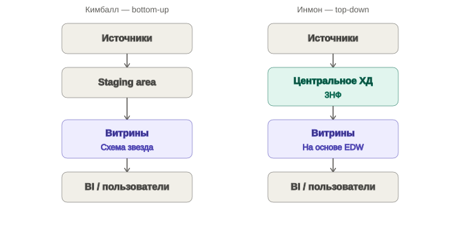
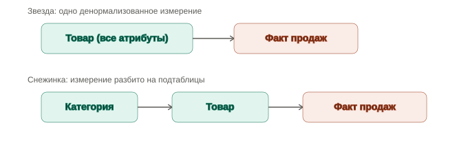

## Конспект: классические методологии построения ХД — Кимбалл и Инмон

### 1. Два классических подхода

Есть два основных подхода к построению корпоративного хранилища данных:

|                 | **Ральф Кимбалл**                              | **Билл Инмон**                           |
| --------------- | ---------------------------------------------- | ---------------------------------------- |
| Основная идея   | ХД как набор интегрированных витрин            | ХД как единое централизованное хранилище |
| Направление     | **Снизу вверх (Bottom-Up)**                    | **Сверху вниз (Top-Down)**               |
| Модель          | Звезда / многомерная                           | Нормализованная, обычно **3НФ**          |
| Основной объект | Бизнес-процесс                                 | Корпоративные данные                     |
| Витрины         | Создаются в первую очередь                     | Создаются после корпоративного ХД        |
| Главный плюс    | Простота и скорость аналитики                  | Целостность и единообразие данных        |
| Главный минус   | Сложнее обеспечить целостность/масштабирование | Сложнее и дороже для пользователей       |



> ➕ На собеседовании часто спрашивают: «А что, если и то, и то?» — рядом с этими двумя обычно упоминают третий, более современный подход: **Data Vault** (Дэн Линстедт). Это гибрид: сырые данные хранятся в связках Hub/Link/Satellite (устойчивая структура, не меняется при добавлении источников), а сверху уже строятся витрины по Кимбаллу. В банковском ХД это встречается чаще, чем чистый Инмон, — держи в голове хотя бы название и что это «третий путь», если спросят.

---

# 2. Подход Кимбалла ⭐

### Главная идея

Кимбалл предлагает строить ХД как **набор предметных витрин**, каждая из которых ориентирована на конкретный бизнес-процесс.

Например:

* продажи;
* покупки;
* платежи;
* инвентаризация;
* заказы.

Витрины объединяются между собой через **архитектуру шины (Bus Architecture)**.

### Многомерная модель

Основу составляют:

**Таблица фактов + таблицы измерений → схема «звезда»**

Например:

```text
                 Измерение Дата
                       |
Измерение Клиент — ФАКТ ПРОДАЖ — Измерение Товар
                       |
                 Измерение Магазин
```

> ➕ Схема выше — это **звезда** (star schema): измерения не декомпозированы, лежат в одной денормализованной таблице каждое. Если измерение разбить дальше на связанные подтаблицы (например, «Товар» → «Категория» → «Группа категорий» отдельными таблицами) — это уже **снежинка** (snowflake schema). Снежинка экономит место и убирает избыточность, но добавляет джойны и медленнее для BI. Кимбалл в классике — за звезду, снежинку используют как компромисс при очень «толстых» измерениях.



### Факты

**Факты = числовые показатели бизнес-процесса.**

Например:

* сумма покупки;
* количество товара;
* стоимость заказа;
* количество платежей.

Факт обычно имеет:

* **много строк**;
* относительно **мало столбцов**.

> ➕ **Типы таблиц фактов** (частый вопрос на интервью):
> - **Transaction fact** — одна строка = одно событие (одна продажа, один платёж). Самая частая. Пример из этого конспекта — витрина продаж.
> - **Periodic snapshot** — одна строка = состояние на конец периода (остаток на счёте на конец дня, баланс склада на конец месяца). Строки не добавляются к событиям, а фиксируют срез.
> - **Accumulating snapshot** — одна строка = весь жизненный цикл процесса, обновляется по мере прохождения стадий (заявка на кредит: подана → на скоринге → одобрена → выдана). Одна из немногих таблиц фактов, где строки **обновляются**, а не только вставляются.

> ➕ **Аддитивность фактов** — тоже почти гарантированный вопрос:
> - **Аддитивный факт** — можно суммировать по любому измерению (сумма продаж по товару, по дате, по магазину — всё складывается корректно).
> - **Полуаддитивный** — можно суммировать не по всем измерениям. Классика — остаток на счёте: сумма остатков по клиентам на одну дату — нормально, а сумма остатков одного клиента за несколько дат — бессмысленна (это как средняя температура по палате). Для таких метрик по дате обычно берут `AVG` или последнее значение, а не `SUM`.
> - **Неаддитивный** — нельзя суммировать вообще (процентная ставка, курс валюты). Такие факты обычно храшят на уровне детализации и агрегируют через `AVG`/`WEIGHTED AVG`, никогда через `SUM`.

### Измерения

**Измерения = описательные характеристики фактов.**

Например, для товара:

* товар;
* категория;
* бренд;
* производитель.

Измерения обычно имеют:

* относительно **мало строк**;
* много атрибутов;
* **денормализованную структуру**.

> ➕ **SCD — Slowly Changing Dimensions (медленно меняющиеся измерения).** Это именно тот механизм, которым Кимбалл отвечает на вопрос «что было раньше», а не только «что сейчас» — в конспекте ниже это ошибочно выглядит как исключительно фича Инмона, но на практике это устройство самих измерений в звезде:
> - **SCD1** — перезапись старого значения новым, история не хранится (клиент сменил телефон — просто обновили поле).
> - **SCD2** — новая строка при изменении, старая помечается как неактуальная (`valid_from`, `valid_to`, `is_current` или `effective_date`/`end_date`), плюс отдельный **суррогатный ключ** у каждой версии строки (естественный бизнес-ключ, например `client_id`, при этом остаётся одним и тем же). Это основной способ хранить полноценную историю в звёздной модели.
> - **SCD3** — старое значение хранится в отдельном столбце («предыдущий адрес»), без размножения строк — подходит, когда важна только последняя предыдущая версия, а не вся история.
>
> Суррогатный ключ (surrogate key, обычно `INT`/`BIGINT` identity или хэш) в измерениях Кимбалла нужен ещё и потому, что естественный бизнес-ключ при SCD2 повторяется в нескольких строках — джойн с фактами идёт по суррогатному ключу, а не по бизнес-ключу.
>
> 🖱️ Интерактивное сравнение всех трёх вариантов на одном и том же примере: [scd_comparison.html](scd_comparison.html) (открыть в браузере).

---

## 3. Как строится ХД по Кимбаллу

Схема:

```text
Операционные системы
        ↓
   Staging Area
   (очистка данных)
        ↓
   Витрины данных
        ↓
 Пользователи / BI
```

Каждая витрина соответствует определённому бизнес-процессу.

### 4 шага Кимбалла

**1. Выбрать бизнес-процесс**

Например: продажи.

**2. Определить grain — уровень детализации**

Это очень важный момент.

Нужно ответить:

> Что означает одна строка таблицы фактов?

Например:

> одна строка = одна позиция одного заказа.

Самый подробный уровень называется **атомарным**.

**3. Выбрать измерения**

Например:

* Клиент;
* Товар;
* Дата;
* Магазин.

**4. Выбрать факты**

Например:

* количество;
* сумма;
* скидка.

---

# 4. Архитектура шины Кимбалла

Главная проблема нескольких витрин — как сделать их согласованными.

Для этого используются **согласованные измерения (Conformed Dimensions)**.

Например, если в витринах:

```text
Продажи
Закупки
Логистика
```

используется одно и то же измерение **«Дата»**, оно должно иметь одинаковый смысл и структуру.

То есть:

> одинаковые измерения → возможность объединять и сравнивать разные бизнес-процессы.

Это и есть одна из ключевых идей Кимбалла.

---

# 5. Плюсы и минусы Кимбалла

### ✅ Плюсы

* высокая производительность аналитических запросов;
* простота для конечного пользователя;
* понятная модель «звезда»;
* прямой доступ пользователей к витринам;
* удобно строить BI-отчёты.

### ❌ Минусы

* сложнее расширять систему;
* сложнее поддерживать целостность всего корпоративного ХД;
* изменения могут требовать изменений нескольких витрин;
* существует риск дублирования данных.

---

# 6. Подход Билла Инмона 🏢

Инмон рассматривает ХД прежде всего как:

> **централизованный репозиторий корпоративных данных.**

В отличие от Кимбалла, сначала строится **единое корпоративное ХД**, а уже потом на его основе создаются витрины.

Схематично:

```text
Операционные системы
        ↓
Централизованное ХД
     (3НФ)
        ↓
  Витрины данных
        ↓
 Пользователи / BI
```

Это **нисходящий подход (Top-Down)**.

---

# 7. Корпоративная информационная фабрика Инмона

Инмон называет свою архитектуру:

**Corporate Information Factory (CIF)**.

В ней выделяются четыре уровня:

### 1. Оперативный уровень

Источники транзакционных данных:

```text
OLTP / банковские системы / CRM / ERP
```

Предназначен для ежедневной работы организации.

### 2. Хранилище атомарных данных

Сюда поступают унифицированные данные из оперативных систем.

Главная идея:

> хранить данные на максимально детальном уровне.

Хранилище строится преимущественно в **третьей нормальной форме (3НФ)**.

### 3. Ведомственный уровень

Данные для конкретных подразделений.

Они могут быть:

* агрегированными;
* частично агрегированными;
* подготовленными под конкретные аналитические задачи.

### 4. Индивидуальный уровень

Временные наборы данных, которые создают отдельные пользователи для собственного анализа.

---

# 8. Основные свойства ХД по Инмону

### Предметная ориентированность

Данные организованы вокруг предметных областей:

* клиент;
* продукт;
* договор;
* счёт;
* платеж и т. д.

### Отслеживание изменений

История изменений данных сохраняется.

Можно ответить не только:

> «Что сейчас?»

но и:

> «Что было раньше?»

> ➕ В 3НФ у Инмона история обычно хранится через **версионирование строк с датами действия** (по сути тот же принцип, что SCD2, но на уровне нормализованной модели, а не денормализованной дименсии) — механизм отличается по форме, но задача та же, что решает SCD2 у Кимбалла.

### Энергонезависимость

Данные ХД не предназначены для постоянного перезаписывания как в OLTP.

Информация сохраняется для последующего анализа.

### Интегрированность

Данные из разных систем:

```text
Система А
Система Б
Система В
      ↓
единое ХД
```

приводятся к единому формату и смыслу.

---

# 9. Плюсы и минусы Инмона

### ✅ Плюсы

* единое физическое корпоративное ХД;
* высокая целостность данных;
* централизованное управление;
* высокая детализация;
* согласованность данных различных подразделений;
* проще формировать разные витрины на единой основе.

### ❌ Минусы

* сложнее для обычного пользователя;
* нет прямого удобного доступа к нормализованному ХД;
* создание и поддержка требуют больше ресурсов;
* аналитические запросы к 3НФ могут быть сложнее.

---

# 10. Самое главное различие

Запомни одной картинкой:

```text
             КИМБАЛЛ
         «СНИЗУ ВВЕРХ»

Источники
   ↓
Staging
   ↓
Витрина продаж ─┐
Витрина покупок ├→ единая система витрин
Витрина платежей┘
```

```text
              ИНМОН
         «СВЕРХУ ВНИЗ»

Источники
   ↓
ЦЕНТРАЛЬНОЕ ХД
    (3НФ)
   ↓
Витрина продаж
Витрина покупок
Витрина платежей
```

### Формула для собеседования

**Кимбалл:**

> бизнес-процесс → grain → измерения → факты → звезда → витрина.

**Инмон:**

> источники → интегрированное корпоративное ХД в 3НФ → витрины.

---

## 🧠 Что тебе особенно важно запомнить для DWH-собеседования

Не просто:

> «Кимбалл — звезда, Инмон — 3НФ».

А связку:

**Кимбалл → Bottom-Up → бизнес-процессы → витрины → dimensional model → facts/dimensions → денормализация.**

**Инмон → Top-Down → предприятие → централизованное ХД → 3НФ → затем витрины.**

И ещё один важный термин Кимбалла:

> **Conformed Dimensions — согласованные измерения**, благодаря которым разные витрины остаются интегрированными.

Это уже тот уровень, который имеет смысл уверенно рассказывать на собеседовании DWH/System Analyst.

> ➕ И добавь к этому списку то, что реально спрашивают на живых интервью чаще, чем «звезда vs 3НФ»:
> - типы таблиц фактов (transaction / periodic snapshot / accumulating snapshot);
> - аддитивность фактов (additive / semi-additive / non-additive) — почти всегда спрашивают через пример «остаток на счёте»;
> - SCD1/SCD2/SCD3 и зачем нужен суррогатный ключ;
> - звезда vs снежинка — когда denormalize оправдан.
