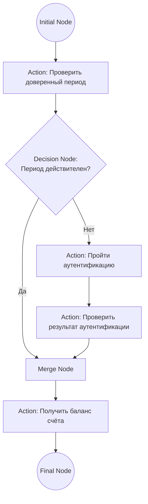
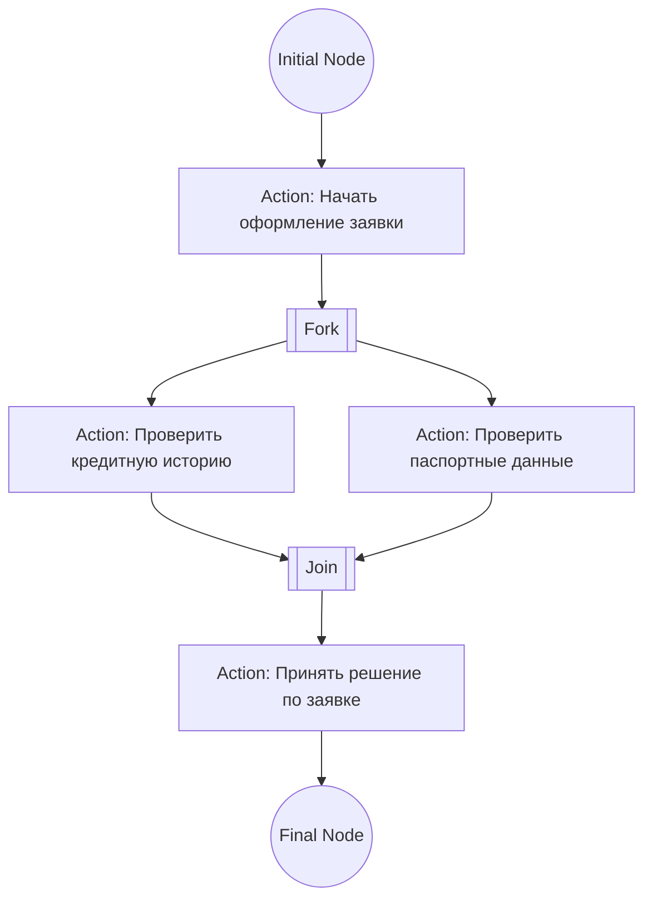

# Системный анализ — Блок 3: Activity Diagram (UML)

## 1. Сравнение элементов: BPMN vs Activity Diagram

| BPMN | Activity Diagram (UML) | Разница |
|---|---|---|
| Start/End Event (круги) | Initial Node / Final Node | В UML нет деления на «промежуточные события», как в BPMN |
| Task | **Action** | В UML нет типизации задач (User/Service/Script Task) — просто действие |
| Exclusive Gateway (один тип и на развилку, и на слияние) | **Decision Node** (развилка) / **Merge Node** (слияние) — два разных узла одинаковой формы (ромб) | Различаются по числу входящих/исходящих стрелок, а не по названию элемента |
| Parallel Gateway | **Fork** / **Join** (жирная полоса) | Параллельность — отдельный явный символ, не ромб |
| Swimlanes | Swimlanes | Одинаково в обеих нотациях |

**Концептуальное отличие:** BPMN — язык для бизнес-процессов между ролями/системами (акцент на «кто за что отвечает»). Activity Diagram — часть UML, исторически ближе к описанию алгоритма/логики выполнения, акцент на поток управления (control flow), включая параллелизм через Fork/Join.

На практике в РФ: BPMN чаще для процессов между отделами/системами, Activity Diagram — чаще для логики внутри одного модуля/алгоритма.

## 2. Условные обозначения (текстовая схема)

```
●                    Initial Node (начало)
[ Action ]           Действие — прямоугольник со скруглёнными углами
◇  Decision Node     Ромб — развилка (одна ветка из нескольких по условию)
◇  Merge Node        Ромб — слияние веток обратно в одну
▐▐  Fork / Join      Жирная полоса — разделение/слияние параллельных потоков
◉                    Final Node (конец, кружок с точкой внутри)
```

## 3. Пример: диаграмма «Баланс счёта с доверенным периодом» в нотации Activity Diagram



Тот же процесс текстом (для сравнения с BPMN-версией из прошлой сессии):

```
(Initial Node)
[Action]: Проверить доверенный период аутентификации
<Decision Node>: Период действителен?
    Да → к Merge Node
    Нет →
        [Action]: Пройти аутентификацию
        [Action]: Проверить результат аутентификации
<Merge Node>
[Action]: Получить баланс счёта
(Final Node)
```

Разница с BPMN-версией — только в названиях узлов (Decision/Merge вместо Exclusive Gateway, Action вместо Task, Initial/Final Node вместо Start/End Event). Логика процесса и структура ветвления идентичны — это ожидаемо, потому что содержательно это один и тот же процесс, просто нарисованный в другой нотации.

## 4. Fork / Join — для справки (не разбирали на этой сессии подробно)

Используется, когда несколько действий должны выполняться **одновременно**, а не по одной из веток:



Fork разделяет поток на параллельные ветки, Join дожидается завершения всех веток перед тем, как продолжить — в отличие от Decision/Merge, где выполняется только одна из веток.

---
**Следующий шаг ветки:** не определён — на выбор: разбор параллелизма (Fork/Join) подробнее, или переход к мок-интервью на основе всего пройденного материала (требования → use case → НФТ → BPMN → Activity Diagram).
